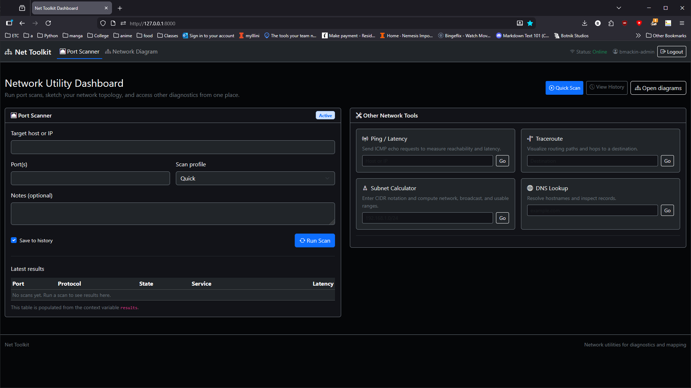

This project aims to create a network topology mapper.

This will map and visualize the relationships between devices on my home network. Each device has details like the hostname, IP, MAC, and their connections which will be collected and visualized.

After returning to this project, I realized that the original idea I had for this project was not suited to django. The idea of a deployed webapp clashed with the desire to scan a home network. What's the point of scanning if it's not on your network?
Because of this, I will be creating a port scanner, network mapping tools, and other tools. Port scanning does not require you to be on the same network to function, so this fits a lot better.

Internal tester's login credentials: mohitg2 / graingerlibrary
Internal guest's login credentials: infoadmins / uiucinfo

Table 2 implementations:
2 Static files:
My static files use bootstrap for styling. It is a dark themed webapp.

3 Charts:
While I do this with JS, the network diagram is still a type of chart. This is saved and pulled from the database, meaning it is the same all the time.

4 Forms:
I use forms to send data to the backend, such as the IP/port, or any other of the functions. I primarily use post to achieve this.

7 data presentation:
Whenever I run a ping or other backend function, I then send it to the frontend in a formatted way.

8 user authentication:
I have a login and registration page. Certain links are hidden from non-logged in users.

